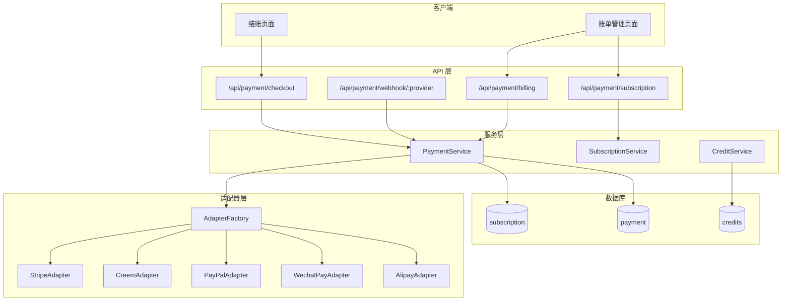
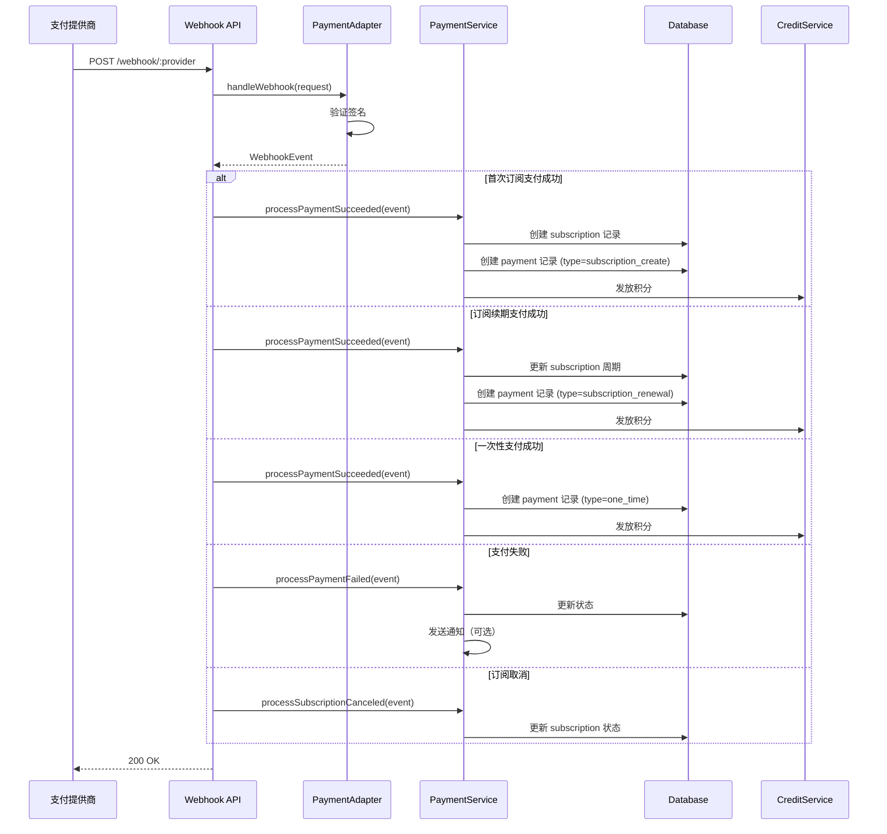

# 支付系统重构方案

## 一、架构概览



## 二、支付能力矩阵

| Provider | 订阅 | 一次性 | Webhook | Customer Portal | 备注 |

|----------|:----:|:------:|:-------:|:---------------:|------|

| Stripe | Yes | Yes | Yes | Yes | 主力（国际） |

| Creem | Yes | Yes | Yes | No | 保留 |

| PayPal | Yes | Yes | Yes | Yes | 新增 |

| 微信支付 | No | Yes | Yes | No | 仅一次性（国内） |

| 支付宝 | No | Yes | Yes | No | 仅一次性（国内） |

## 三、数据库设计

### 1. subscription 表（新增）

```sql
CREATE TABLE subscription (
  id TEXT PRIMARY KEY,

  -- 提供商信息
  provider TEXT NOT NULL,           -- stripe, creem, paypal
  provider_subscription_id TEXT,    -- 提供商的订阅 ID
  provider_customer_id TEXT,        -- 提供商的客户 ID

  -- 关联
  user_id TEXT NOT NULL REFERENCES user(id),
  plan_id TEXT NOT NULL,            -- 对应配置中的 planId
  price_id TEXT NOT NULL,           -- 对应提供商的 priceId

  -- 订阅信息
  status TEXT NOT NULL,             -- active, canceled, past_due, trialing, paused
  interval TEXT,                    -- month, year
  amount INTEGER,
  currency TEXT DEFAULT 'usd',

  -- 周期
  current_period_start TIMESTAMP,
  current_period_end TIMESTAMP,

  -- 取消信息
  cancel_at_period_end BOOLEAN DEFAULT FALSE,
  canceled_at TIMESTAMP,
  cancel_reason TEXT,

  -- 试用期
  trial_start TIMESTAMP,
  trial_end TIMESTAMP,

  created_at TIMESTAMP NOT NULL,
  updated_at TIMESTAMP
);
```

### 2. payment 表（重构）

```sql
CREATE TABLE payment (
  id TEXT PRIMARY KEY,

  -- 提供商信息
  provider TEXT NOT NULL,           -- stripe, creem, paypal, wechat, alipay
  provider_payment_id TEXT,         -- 提供商的支付 ID
  provider_invoice_id TEXT,         -- 发票 ID（如果有）

  -- 关联
  user_id TEXT NOT NULL REFERENCES user(id),
  subscription_id TEXT REFERENCES subscription(id),  -- 可选，订阅支付时关联

  -- 支付类型
  payment_type TEXT NOT NULL,       -- subscription_create, subscription_renewal, one_time

  -- 金额
  amount INTEGER NOT NULL,
  currency TEXT NOT NULL,

  -- 状态
  status TEXT NOT NULL,             -- pending, succeeded, failed, refunded

  -- 关联的计划/积分包
  plan_id TEXT,                     -- 来源计划 ID
  price_id TEXT,                    -- 来源价格 ID

  -- 退款信息
  refunded_at TIMESTAMP,
  refund_amount INTEGER,

  -- 元数据
  metadata JSONB,

  created_at TIMESTAMP NOT NULL,
  updated_at TIMESTAMP
);
```

### 3. 修改 user 表

```sql
-- 移除 customerId，改用 provider_customers JSONB
ALTER TABLE user ADD COLUMN provider_customers JSONB;
-- 格式: { "stripe": "cus_xxx", "paypal": "xxx", "creem": "xxx" }
```

## 四、适配器接口设计

### 核心接口

```typescript
// src/integrations/payment/types.ts

export enum PaymentProvider {
  STRIPE = 'stripe',
  CREEM = 'creem',
  PAYPAL = 'paypal',
  WECHAT = 'wechat',
  ALIPAY = 'alipay',
}

export enum PaymentEventType {
  CHECKOUT_COMPLETED = 'checkout.completed',
  PAYMENT_SUCCEEDED = 'payment.succeeded',
  PAYMENT_FAILED = 'payment.failed',
  SUBSCRIPTION_CREATED = 'subscription.created',
  SUBSCRIPTION_UPDATED = 'subscription.updated',
  SUBSCRIPTION_CANCELED = 'subscription.canceled',
  SUBSCRIPTION_RENEWED = 'subscription.renewed',  // 续期
  REFUND_CREATED = 'refund.created',
}

export enum SubscriptionCycleType {
  CREATE = 'create',    // 首次订阅
  RENEWAL = 'renewal',  // 续期
}

export interface PaymentAdapter {
  readonly name: PaymentProvider;
  readonly capabilities: AdapterCapabilities;

  // 创建支付
  createCheckout(params: CreateCheckoutParams): Promise<CheckoutResult>;

  // 处理 Webhook
  handleWebhook(request: Request): Promise<WebhookEvent>;

  // 订阅管理（可选）
  cancelSubscription?(subscriptionId: string): Promise<void>;

  // 客户门户（可选）
  getCustomerPortalUrl?(customerId: string, returnUrl: string): Promise<string>;

  // 查询支付状态
  getPaymentStatus?(paymentId: string): Promise<PaymentStatus>;
}

export interface AdapterCapabilities {
  subscription: boolean;
  oneTime: boolean;
  customerPortal: boolean;
  refund: boolean;
}
```

### Webhook 事件结构

```typescript
export interface WebhookEvent {
  type: PaymentEventType;
  provider: PaymentProvider;

  // 支付信息（支付成功/失败时）
  payment?: {
    providerPaymentId: string;
    providerInvoiceId?: string;
    amount: number;
    currency: string;
    status: 'succeeded' | 'failed';
    cycleType?: SubscriptionCycleType;  // 区分首次/续期
    metadata?: Record<string, string>;
  };

  // 订阅信息（订阅事件时）
  subscription?: {
    providerSubscriptionId: string;
    providerCustomerId: string;
    status: SubscriptionStatus;
    currentPeriodStart: Date;
    currentPeriodEnd: Date;
    cancelAtPeriodEnd?: boolean;
    metadata?: Record<string, string>;
  };

  // 原始数据
  rawEvent: unknown;
}
```

## 五、事件处理流程



## 六、关键代码实现位置

### 目录结构

```
src/integrations/payment/
├── index.ts                    # PaymentService 主入口
├── types.ts                    # 类型定义
├── adapter-factory.ts          # 适配器工厂
├── adapters/
│   ├── base.ts                 # 基类（公共逻辑）
│   ├── stripe.ts               # Stripe 适配器
│   ├── creem.ts                # Creem 适配器
│   ├── paypal.ts               # PayPal 适配器
│   ├── wechat.ts               # 微信支付适配器
│   └── alipay.ts               # 支付宝适配器
├── services/
│   ├── payment.service.ts      # 支付业务逻辑
│   └── subscription.service.ts # 订阅业务逻辑
└── utils/
    └── credits.ts              # 积分处理

src/routes/api/payment/
├── checkout.ts                 # 创建支付
├── webhook/
│   └── [provider].ts           # 动态路由，按提供商分发
├── billing.ts                  # 账单管理
└── subscription.ts             # 订阅管理

src/db/
├── subscription.schema.ts      # 新增
└── payment.schema.ts           # 重构
```

## 七、Stripe 适配器关键改动

重点：处理 `invoice.payment_succeeded` 区分首次/续期

```typescript
// 处理 Stripe Webhook
async handleWebhook(request: Request): Promise<WebhookEvent> {
  const event = await this.verifyAndParseWebhook(request);

  switch (event.type) {
    case 'checkout.session.completed':
      return this.handleCheckoutCompleted(event);

    case 'invoice.payment_succeeded':
      // 关键：通过 billing_reason 区分首次和续期
      const invoice = event.data.object as Stripe.Invoice;
      const cycleType = invoice.billing_reason === 'subscription_create'
        ? SubscriptionCycleType.CREATE
        : SubscriptionCycleType.RENEWAL;
      return this.handlePaymentSucceeded(invoice, cycleType);

    case 'invoice.payment_failed':
      return this.handlePaymentFailed(event);

    case 'customer.subscription.updated':
      return this.handleSubscriptionUpdated(event);

    case 'customer.subscription.deleted':
      return this.handleSubscriptionCanceled(event);
  }
}
```

## 八、微信/支付宝特殊处理

由于微信/支付宝不支持订阅，需要在创建支付时校验：

```typescript
class WechatPayAdapter implements PaymentAdapter {
  readonly capabilities = {
    subscription: false,  // 不支持订阅
    oneTime: true,
    customerPortal: false,
    refund: true,
  };

  async createCheckout(params: CreateCheckoutParams) {
    if (params.type === PaymentType.SUBSCRIPTION) {
      throw new Error('微信支付不支持订阅，请选择其他支付方式');
    }
    // ... 创建一次性支付
  }
}
```

## 九、实施步骤

分阶段实施，确保平稳过渡：

**阶段 1：数据库和基础架构**

- 创建 subscription 表
- 重构 payment 表
- 定义新的类型系统
- 实现适配器基类和工厂

**阶段 2：Stripe 适配器重构**

- 添加 `invoice.payment_succeeded` 处理
- 区分首次订阅和续期
- 添加退款处理
- 添加 Customer Portal 支持

**阶段 3：Creem 适配器更新**

- 按新接口重构
- 修复续期积分发放问题

**阶段 4：PayPal 适配器实现**

- 实现完整的 PayPal 集成
- 支持订阅和一次性支付

**阶段 5：微信/支付宝适配器**

- 实现微信支付适配器
- 实现支付宝适配器
- 仅支持一次性支付

**阶段 6：API 和前端更新**

- 更新 API 路由
- 前端支付方式选择
- 账单管理页面
