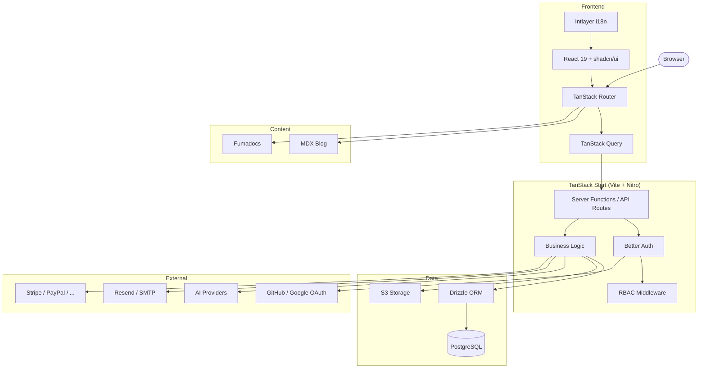

<p align="center">
  
</p>
<h1 align="center">VibeAny</h1>
<p align="center">
  <a href="./README.zh-CN.md">中文</a> | <a href="./README.md">English</a>
</p>
<p align="center">
  Production-grade full-stack boilerplate for modern Vibe Coding.<br />
  Authentication, payments, AI, i18n, and more — out of the box. Go from idea to launch in hours, not days.
</p>
<p align="center">
  <a href="LICENSE"></a>
  <a href="https://github.com/jiahao-jayden/vibe-any-tanstack/stargazers"></a>
  <a href="https://github.com/jiahao-jayden/vibe-any-tanstack/issues"></a>
  <a href="https://discord.gg/FQ2TAHh6"></a>
</p>
<p align="center">
  <a href="https://youtu.be/0DqfKBenvkQ">
    
  </a>
  <a href="https://vibeany.dev/docs">
    
  </a>
</p>
<p align="center">
  <a href="https://youtu.be/0DqfKBenvkQ">
    
  </a>
</p>

## Why VibeAny

We noticed that many people have to repeatedly write boilerplate code and rebuild infrastructure when vibe coding new products. VibeAny changes that — with just 10–20 minutes of configuration, you get:

- Complete **authentication** system with email/password, Google/GitHub OAuth, magic links
- Multi-provider **AI chat** with 100+ models (OpenAI, Claude, Gemini, DeepSeek, Grok, and more)
- **Payment** integration with Stripe, Creem, PayPal, WeChat Pay, Alipay — subscriptions & one-time
- **Credit system** for AI monetization with daily rewards, sign-up bonuses, and FIFO consumption
- Enterprise-grade **landing page** components — responsive and SEO-friendly
- **Admin panel** with user management, dynamic config, role management
- **Blog & Docs** powered by MDX and Fumadocs, with full-text search
- Type-safe **i18n** with Intlayer — translation errors caught at compile time

## Screenshots

<table>
  <tr>
    <td align="center"><b>🔐 Authentication</b></td>
    <td align="center"><b>🤖 AI Chat (100+ models)</b></td>
  </tr>
  <tr>
    <td></td>
    <td></td>
  </tr>
  <tr>
    <td align="center"><b>💳 Payment & Pricing</b></td>
    <td align="center"><b>⚙️ Dynamic Config</b></td>
  </tr>
  <tr>
    <td></td>
    <td></td>
  </tr>
  <tr>
    <td align="center"><b>📝 Blog & Roadmap</b></td>
    <td align="center"><b>📚 Documentation</b></td>
  </tr>
  <tr>
    <td></td>
    <td></td>
  </tr>
</table>

## Features

| Category | What You Get |
|----------|-------------|
| **Framework** | TanStack Start + React 19 + Vite — file-based routing, SSR, server functions |
| **Auth** | Email/password, Google, GitHub OAuth, magic links, email verification (Better Auth) |
| **RBAC** | Role-based access control with permission inheritance |
| **AI** | Vercel AI SDK with 12 providers, 100+ models, streaming responses |
| **Payments** | Stripe, Creem, PayPal, WeChat Pay, Alipay — subscriptions & one-time payments |
| **Credits** | Token-based AI billing with FIFO consumption, daily rewards, sign-up bonuses |
| **Landing Page** | Hero, features, benefits, testimonials, FAQ, CTA — all configurable |
| **Blog & Docs** | MDX-powered blog + Fumadocs documentation, multilingual |
| **Changelog & Roadmap** | Product changelog timeline and visual roadmap board |
| **Admin Panel** | User management, system configuration, role management |
| **i18n** | Type-safe internationalization with Intlayer (English + Chinese out of the box) |
| **Email** | Verification and magic link emails via Resend or custom SMTP |
| **Storage** | S3-compatible upload (Cloudflare R2, AWS S3, MinIO) |
| **UI** | Tailwind CSS v4, shadcn/ui, Radix primitives, Lucide icons |
| **Theme** | Light / dark / system with one-click toggle |
| **Deployment** | Node.js, Docker, or **Cloudflare Workers** (edge-native with D1 + R2) |

## Architecture



## Tech Stack

| Layer | Technology |
|-------|-----------|
| Framework | [TanStack Start](https://tanstack.com/start) + [React 19](https://react.dev) + [Vite](https://vite.dev) |
| Routing | [TanStack Router](https://tanstack.com/router) (file-based) |
| Data Fetching | [TanStack Query](https://tanstack.com/query) |
| Database | [PostgreSQL](https://www.postgresql.org) + [Drizzle ORM](https://orm.drizzle.team) |
| Auth | [Better Auth](https://www.better-auth.com) |
| Payments | [Stripe](https://stripe.com) / Creem / PayPal / WeChat / Alipay |
| AI | [Vercel AI SDK](https://sdk.vercel.ai) (12 providers, 100+ models) |
| Styling | [Tailwind CSS v4](https://tailwindcss.com) + [shadcn/ui](https://ui.shadcn.com) |
| i18n | [Intlayer](https://intlayer.org) |
| Content | [Fumadocs](https://fumadocs.dev) (docs) + MDX (blog) |
| Validation | [Zod](https://zod.dev) |
| State | [Zustand](https://zustand.docs.pmnd.rs) |
| Animation | [Motion](https://motion.dev) |
| Linting | [Biome](https://biomejs.dev) |

## Quick Start

### Prerequisites

- Node.js 20+
- pnpm 9+
- PostgreSQL database

### 1. Clone and install

```bash
git clone https://github.com/jiahao-jayden/vibe-any-tanstack.git
cd vibe-any
pnpm install
```

### 2. Configure environment

```bash
cp .env.example .env.local
```

The app runs in **static mode** with zero configuration — landing page, blog, and docs work without a database. To enable auth and user features, set `DATABASE_URL` and `BETTER_AUTH_SECRET`.

### 3. Set up database (optional)

```bash
pnpm db:push
```

### 4. Start development

```bash
pnpm dev
```

Open [http://localhost:3377](http://localhost:3377).

> For full setup instructions including AI, payments, and email, see the [Documentation](https://vibeany.dev/docs).

## Project Structure

```
src/
├── actions/          # Server actions
├── config/           # Site config, i18n content, dynamic config
├── db/               # Drizzle schema (auth, config, RBAC)
├── integrations/     # RBAC checker, storage, TanStack Query, AI
├── routes/
│   ├── api/          # API routes (auth, admin, file upload)
│   └── {-$locale}/   # Page routes with i18n prefix
│       ├── _main/
│       │   ├── _landing/   # Landing pages (home, blog, changelog, etc.)
│       │   ├── admin/      # Admin panel
│       │   └── chat/       # AI chat
│       ├── docs/     # Documentation
│       └── login/    # Login page
├── services/         # Business logic
└── shared/
    ├── components/   # UI components
    ├── context/      # React context (global state)
    ├── hooks/        # Custom hooks
    ├── lib/          # Utilities (auth, email, config, tools)
    ├── middleware/    # Route middleware (auth, locale)
    ├── model/        # Database query functions
    └── types/        # TypeScript types
```

## Deployment

### Cloudflare Workers

Deploy to the edge with zero cold starts using Cloudflare Workers + D1 (SQLite) + R2 (storage):

```bash
pnpm build:cf
wrangler deploy
```

Configure `wrangler.toml` with your D1 database and R2 bucket bindings. See the [Cloudflare deployment guide](https://vibeany.dev/docs) for details.

### Docker

```bash
docker build -t vibe-any .
docker run -d -p 3000:3000 vibe-any
```

### Node.js

```bash
pnpm build
node .output/server/index.mjs
```

Works with any Node.js hosting — Vercel, Railway, Fly.io, VPS, Docker, etc.

## Contributing

Contributions are welcome! Please read the [Contributing Guide](CONTRIBUTING.md) before submitting a PR.

## Community

- [Discord](https://discord.gg/FQ2TAHh6) — Chat with the team and other developers
- [GitHub Issues](https://github.com/jiahao-jayden/vibe-any-tanstack/issues) — Report bugs or request features
- [Documentation](https://vibeany.dev/docs) — Full setup and usage guide

## License

[Apache License 2.0](LICENSE)
