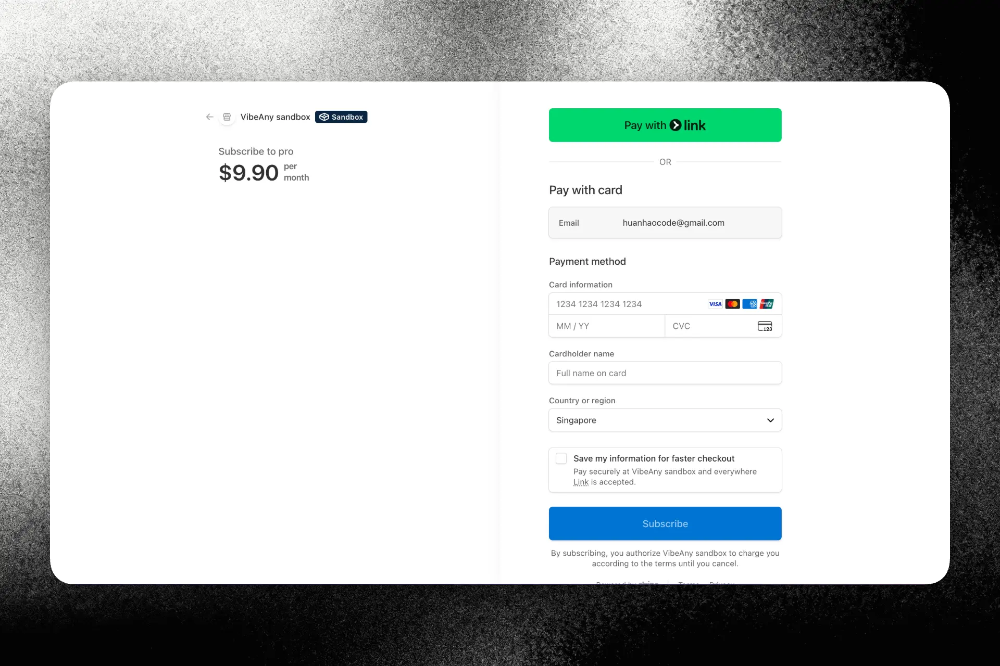
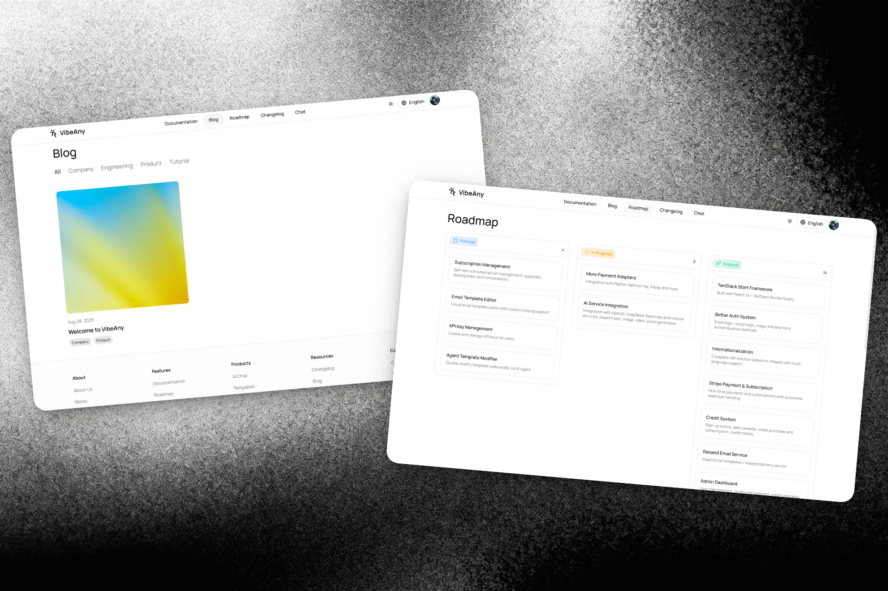
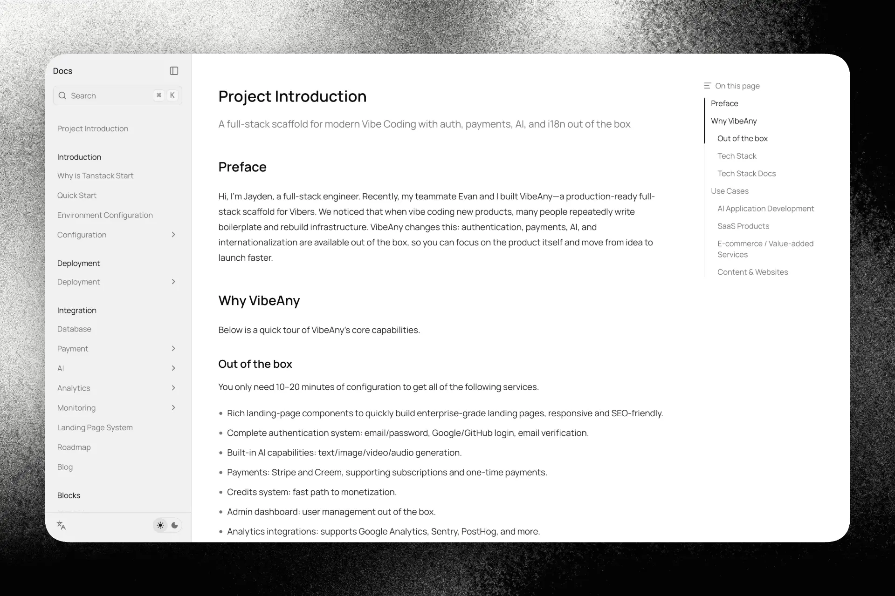
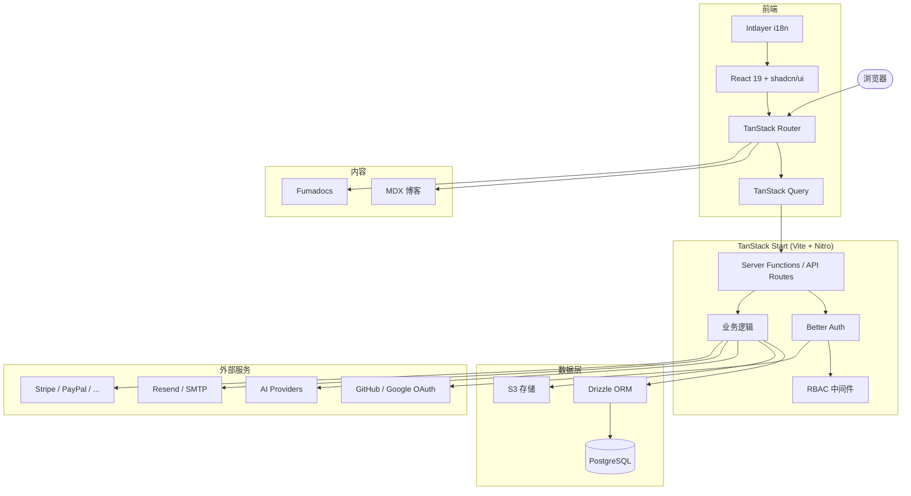

<p align="center">
  
</p>
<h1 align="center">VibeAny</h1>
<p align="center">
  <a href="./README.zh-CN.md">中文</a> | <a href="./README.md">English</a>
</p>
<p align="center">
  为现代 Vibe Coding 打造的生产级全栈模板。<br />
  认证、支付、AI、国际化等开箱即用，从想法到上线只需数小时。
</p>
<p align="center">
  <a href="LICENSE"></a>
  <a href="https://github.com/jiahao-jayden/vibe-any-tanstack/stargazers"></a>
  <a href="https://github.com/jiahao-jayden/vibe-any-tanstack/issues"></a>
  <a href="https://discord.gg/FQ2TAHh6"></a>
</p>
<p align="center">
  <a href="https://youtu.be/0DqfKBenvkQ">
    
  </a>
  <a href="https://vibeany.dev/docs">
    
  </a>
</p>
<p align="center">
  <a href="https://youtu.be/0DqfKBenvkQ">
    
  </a>
</p>

## 为什么选择 VibeAny

我们发现很多人在 vibe coding 新产品时，不得不反复编写样板代码、重建基础设施。VibeAny 改变了这一切——只需 10–20 分钟配置，你就能获得：

- 完整的**认证系统**：邮箱密码、Google/GitHub OAuth、魔法链接
- 多供应商 **AI 聊天**：100+ 模型（OpenAI、Claude、Gemini、DeepSeek、Grok 等）
- **支付集成**：Stripe、Creem、PayPal、微信支付、支付宝——订阅和一次性付款
- **积分系统**：AI 计费，支持每日奖励、注册赠送、FIFO 消耗策略
- 企业级**落地页**组件——响应式设计，SEO 友好
- **管理后台**：用户管理、动态配置、角色管理
- **博客和文档**：基于 MDX 和 Fumadocs，支持全文搜索
- 类型安全的**国际化**：使用 Intlayer，翻译错误在编译时捕获

## 功能截图

<table>
  <tr>
    <td align="center"><b>🔐 认证系统</b></td>
    <td align="center"><b>🤖 AI 聊天（100+ 模型）</b></td>
  </tr>
  <tr>
    <td></td>
    <td></td>
  </tr>
  <tr>
    <td align="center"><b>💳 支付与定价</b></td>
    <td align="center"><b>⚙️ 动态配置</b></td>
  </tr>
  <tr>
    <td></td>
    <td></td>
  </tr>
  <tr>
    <td align="center"><b>📝 博客与路线图</b></td>
    <td align="center"><b>📚 文档系统</b></td>
  </tr>
  <tr>
    <td></td>
    <td></td>
  </tr>
</table>

## 功能一览

| 分类 | 内容 |
|------|------|
| **框架** | TanStack Start + React 19 + Vite——基于文件的路由、SSR、服务端函数 |
| **认证** | 邮箱密码、Google、GitHub OAuth、魔法链接、邮箱验证（Better Auth） |
| **RBAC** | 基于角色的权限控制，支持权限继承 |
| **AI** | Vercel AI SDK，12 个供应商，100+ 模型，流式响应 |
| **支付** | Stripe、Creem、PayPal、微信支付、支付宝——订阅和一次性付款 |
| **积分** | Token 计费，FIFO 消耗策略，每日奖励，注册赠送 |
| **落地页** | Hero、功能介绍、用户评价、FAQ、CTA——全部可配置 |
| **博客和文档** | MDX 博客 + Fumadocs 文档，多语言支持 |
| **变更日志与路线图** | 产品更新时间线和可视化路线图看板 |
| **管理后台** | 用户管理、系统配置、角色管理 |
| **国际化** | Intlayer 类型安全国际化（内置中英文） |
| **邮件** | 通过 Resend 或自定义 SMTP 发送验证和魔法链接邮件 |
| **存储** | S3 兼容上传（Cloudflare R2、AWS S3、MinIO） |
| **UI** | Tailwind CSS v4、shadcn/ui、Radix 原语、Lucide 图标 |
| **主题** | 亮色 / 暗色 / 跟随系统，一键切换 |
| **部署** | Node.js、Docker，或 **Cloudflare Workers**（边缘部署，使用 D1 + R2） |

## 架构



## 技术栈

| 层级 | 技术 |
|------|------|
| 框架 | [TanStack Start](https://tanstack.com/start) + [React 19](https://react.dev) + [Vite](https://vite.dev) |
| 路由 | [TanStack Router](https://tanstack.com/router)（基于文件） |
| 数据获取 | [TanStack Query](https://tanstack.com/query) |
| 数据库 | [PostgreSQL](https://www.postgresql.org) + [Drizzle ORM](https://orm.drizzle.team) |
| 认证 | [Better Auth](https://www.better-auth.com) |
| 支付 | [Stripe](https://stripe.com) / Creem / PayPal / 微信 / 支付宝 |
| AI | [Vercel AI SDK](https://sdk.vercel.ai)（12 个供应商，100+ 模型） |
| 样式 | [Tailwind CSS v4](https://tailwindcss.com) + [shadcn/ui](https://ui.shadcn.com) |
| 国际化 | [Intlayer](https://intlayer.org) |
| 内容 | [Fumadocs](https://fumadocs.dev)（文档）+ MDX（博客） |
| 校验 | [Zod](https://zod.dev) |
| 状态管理 | [Zustand](https://zustand.docs.pmnd.rs) |
| 动画 | [Motion](https://motion.dev) |
| 代码规范 | [Biome](https://biomejs.dev) |

## 快速开始

### 前置要求

- Node.js 20+
- pnpm 9+
- PostgreSQL 数据库

### 1. 克隆并安装

```bash
git clone https://github.com/jiahao-jayden/vibe-any-tanstack.git
cd vibe-any
pnpm install
```

### 2. 配置环境变量

```bash
cp .env.example .env.local
```

应用支持**零配置启动**——落地页、博客和文档无需数据库即可运行。如需启用认证和用户功能，请设置 `DATABASE_URL` 和 `BETTER_AUTH_SECRET`。

### 3. 初始化数据库（可选）

```bash
pnpm db:push
```

### 4. 启动开发

```bash
pnpm dev
```

打开 [http://localhost:3377](http://localhost:3377)。

> 完整的配置指南（包括 AI、支付、邮件等）请查看[文档](https://vibeany.dev/docs)。

## 项目结构

```
src/
├── actions/          # 服务端 Actions
├── config/           # 站点配置、国际化内容、动态配置
├── db/               # Drizzle Schema（认证、配置、RBAC）
├── integrations/     # RBAC 检查器、存储、TanStack Query、AI
├── routes/
│   ├── api/          # API 路由（认证、管理、文件上传）
│   └── {-$locale}/   # 带国际化前缀的页面路由
│       ├── _main/
│       │   ├── _landing/   # 落地页（首页、博客、变更日志等）
│       │   ├── admin/      # 管理后台
│       │   └── chat/       # AI 聊天
│       ├── docs/     # 文档
│       └── login/    # 登录页
├── services/         # 业务逻辑
└── shared/
    ├── components/   # UI 组件
    ├── context/      # React Context（全局状态）
    ├── hooks/        # 自定义 Hooks
    ├── lib/          # 工具函数（认证、邮件、配置、工具）
    ├── middleware/    # 路由中间件（认证、语言）
    ├── model/        # 数据库查询函数
    └── types/        # TypeScript 类型
```

## 部署

### Cloudflare Workers

使用 Cloudflare Workers + D1（SQLite）+ R2（存储）部署到边缘节点，零冷启动：

```bash
pnpm build:cf
wrangler deploy
```

在 `wrangler.toml` 中配置 D1 数据库和 R2 存储桶绑定，详见[部署文档](https://vibeany.dev/docs)。

### Docker

```bash
docker build -t vibe-any .
docker run -d -p 3000:3000 vibe-any
```

### Node.js

```bash
pnpm build
node .output/server/index.mjs
```

支持所有 Node.js 托管平台——Vercel、Railway、Fly.io、VPS、Docker 等。

## 参与贡献

欢迎贡献！提交 PR 前请阅读[贡献指南](CONTRIBUTING.md)。

## 社区

- [Discord](https://discord.gg/FQ2TAHh6) — 与团队和其他开发者交流
- [GitHub Issues](https://github.com/jiahao-jayden/vibe-any-tanstack/issues) — 报告 Bug 或提出功能建议
- [文档](https://vibeany.dev/docs) — 完整的配置和使用指南

## 许可证

[Apache License 2.0](LICENSE)
