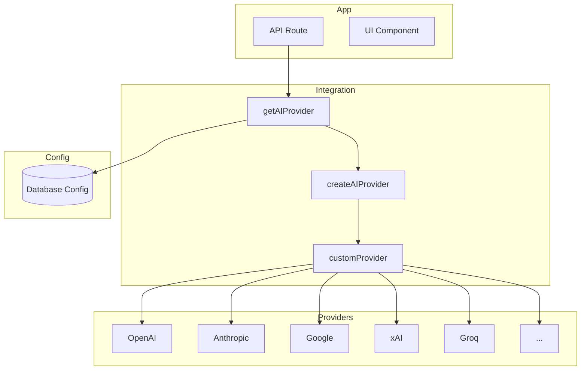

The AI integration layer provides a unified interface for text generation (LLM) across multiple AI providers. It uses [Vercel AI SDK](https://sdk.vercel.ai/) and supports dynamic API key configuration via the admin panel.

## Architecture



## Module Structure

| File | Purpose |
|------|---------|
| `src/integrations/ai/index.ts` | Entry point, `getAIProvider()`, config extraction |
| `src/integrations/ai/providers.ts` | Provider instances and model mapping |
| `src/integrations/ai/models.ts` | Model metadata (id, label, capabilities, creditCost) |
| `src/integrations/ai/types.ts` | Type definitions |
| `src/integrations/ai/utils.ts` | Helper functions |

## Quick Start

### 1. Configure API Keys

Go to **Admin Panel → AI Config** and fill in the API keys for the providers you need. Keys can also be set via environment variables.

### 2. Obtain Provider in API Route

```ts
import { getAIProvider } from "@/integrations/ai"
import { streamText } from "ai"
import { createOpenAI } from "@ai-sdk/openai"

export async function POST(req: Request) {
  const provider = await getAIProvider()
  const model = provider.languageModel("openai/gpt-4o")

  const result = await streamText({
    model,
    messages: [{ role: "user", content: "Hello" }],
  })

  return result.toDataStreamResponse()
}
```

### 3. Use Model Metadata

```ts
import {
  getModelConfig,
  canUseModel,
  hasVisionSupport,
  getCreditCost,
  getModelsByProvider,
} from "@/integrations/ai"

const model = getModelConfig("openai/gpt-4o")
const { canUse } = canUseModel("openai/gpt-4o", isProUser)
const hasVision = hasVisionSupport("openai/gpt-4o")
const cost = getCreditCost("openai/gpt-4o")
const openaiModels = getModelsByProvider("openai")
```

## Supported Providers

| Provider | Models | Config Key |
|----------|--------|------------|
| OpenAI | 22 | `ai_openai_api_key`, `ai_openai_base_url` |
| Anthropic | 5 | `ai_anthropic_api_key` |
| Google | 10 | `ai_google_api_key` |
| xAI | 9 | `ai_xai_api_key` |
| Groq | 6 | `ai_groq_api_key` |
| Mistral | 11 | `ai_mistral_api_key` |
| Cohere | 3 | `ai_cohere_api_key` |
| DeepSeek | 2 | `ai_deepseek_api_key`, `ai_deepseek_base_url` |
| HuggingFace | 11 | `ai_huggingface_api_key` |
| Novita | 21 | `ai_novita_api_key` |
| SiliconFlow | 2 | `ai_siliconflow_api_key` |
| Baseten | 6 | `ai_baseten_api_key` |

## Model ID Format

Model IDs follow the pattern `provider/model-name`, e.g. `openai/gpt-4o`, `anthropic/claude-sonnet-4-5`, `deepseek/deepseek-v3.2`. Use these IDs when calling `provider.languageModel(id)`.

## Related

- [Text / LLM](/docs/integration/ai/text) — Detailed usage and model list
- [Extend](/docs/integration/ai/extend) — Add new provider or model
