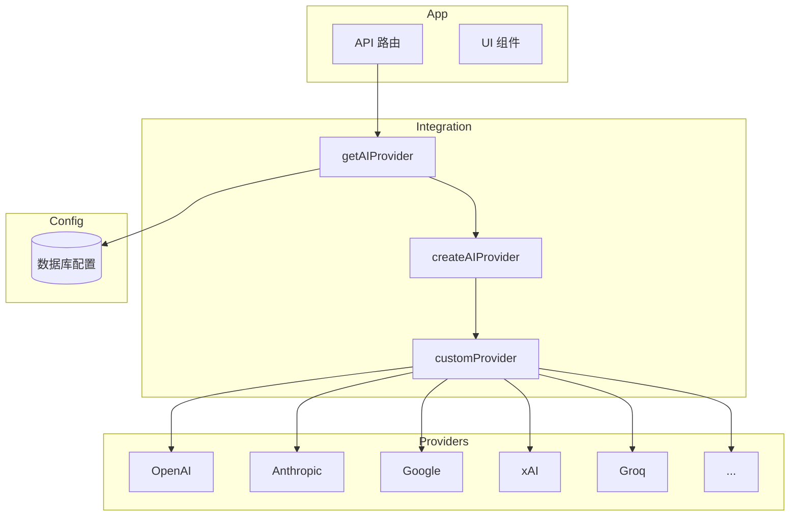

AI 集成层为多厂商大语言模型（LLM）提供统一的文本生成接口，基于 [Vercel AI SDK](https://sdk.vercel.ai/)，支持通过后台管理面板动态配置 API Key。

## 架构



## 模块结构

| 文件 | 说明 |
|------|------|
| `src/integrations/ai/index.ts` | 入口，`getAIProvider()`，配置提取 |
| `src/integrations/ai/providers.ts` | Provider 实例与模型映射 |
| `src/integrations/ai/models.ts` | 模型元数据（id、label、能力、creditCost）|
| `src/integrations/ai/types.ts` | 类型定义 |
| `src/integrations/ai/utils.ts` | 工具函数 |

## 快速开始

### 1. 配置 API Key

进入 **后台 → AI 配置**，填写所需厂商的 API Key。也可通过环境变量配置。

### 2. 在 API 路由中获取 Provider

```ts
import { getAIProvider } from "@/integrations/ai"
import { streamText } from "ai"

export async function POST(req: Request) {
  const provider = await getAIProvider()
  const model = provider.languageModel("openai/gpt-4o")

  const result = await streamText({
    model,
    messages: [{ role: "user", content: "你好" }],
  })

  return result.toDataStreamResponse()
}
```

### 3. 使用模型元数据

```ts
import {
  getModelConfig,
  canUseModel,
  hasVisionSupport,
  getCreditCost,
  getModelsByProvider,
} from "@/integrations/ai"

const model = getModelConfig("openai/gpt-4o")
const { canUse } = canUseModel("openai/gpt-4o", isProUser)
const hasVision = hasVisionSupport("openai/gpt-4o")
const cost = getCreditCost("openai/gpt-4o")
const openaiModels = getModelsByProvider("openai")
```

## 支持的厂商

| 厂商 | 模型数 | 配置项 |
|------|--------|--------|
| OpenAI | 22 | `ai_openai_api_key`, `ai_openai_base_url` |
| Anthropic | 5 | `ai_anthropic_api_key` |
| Google | 10 | `ai_google_api_key` |
| xAI | 9 | `ai_xai_api_key` |
| Groq | 6 | `ai_groq_api_key` |
| Mistral | 11 | `ai_mistral_api_key` |
| Cohere | 3 | `ai_cohere_api_key` |
| DeepSeek | 2 | `ai_deepseek_api_key`, `ai_deepseek_base_url` |
| HuggingFace | 11 | `ai_huggingface_api_key` |
| Novita | 21 | `ai_novita_api_key` |
| SiliconFlow | 2 | `ai_siliconflow_api_key` |
| Baseten | 6 | `ai_baseten_api_key` |

## 模型 ID 格式

模型 ID 格式为 `provider/model-name`，例如 `openai/gpt-4o`、`anthropic/claude-sonnet-4-5`、`deepseek/deepseek-v3.2`。调用 `provider.languageModel(id)` 时使用该 ID。

## 相关

- [文本 / LLM](/docs/integration/ai/text) — 详细用法与模型列表
- [扩展](/docs/integration/ai/extend) — 接入新厂商或模型
